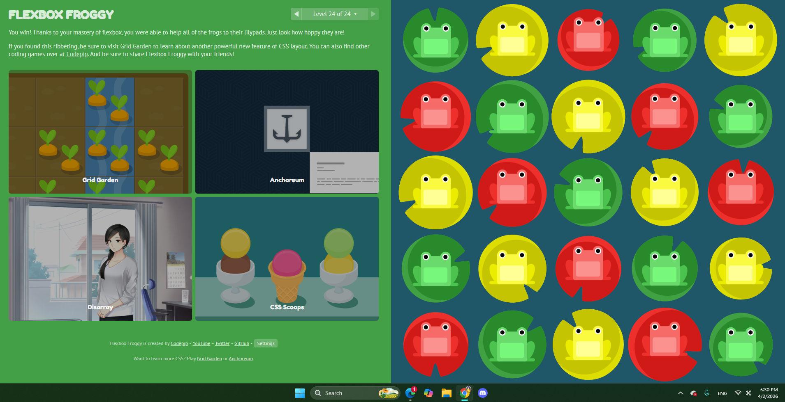
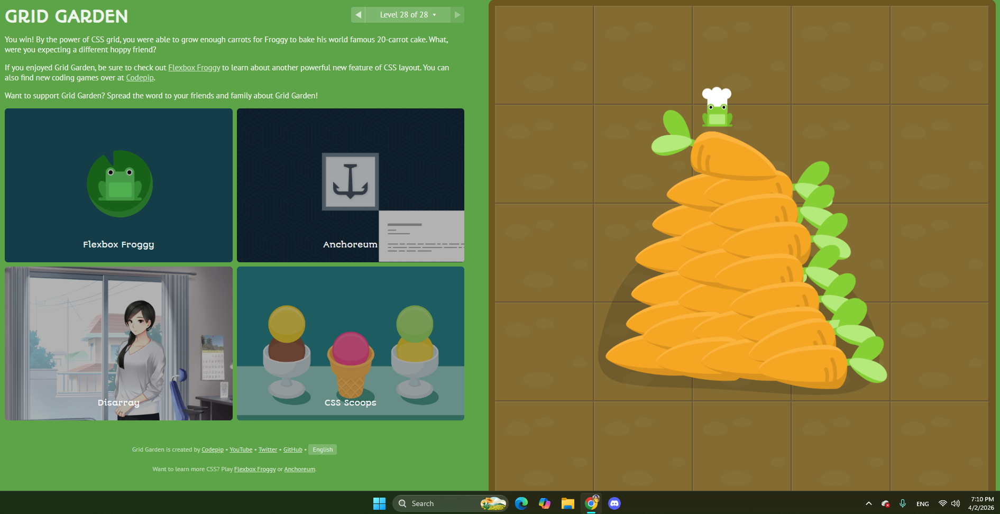

This week has been a little difficult for me only because I had a bunch of other work for other classes and a test to study for. Which means I didn't have a lot of time to work on this as much as I wanted to.
I think I still did pretty well on styling it all despite that. I was going to make a whole FAQ page but I have other assignments due this weekend plus another test on Monday I need to study for.
Overall flexbox and grid are very fun to work with and became musch easier to understand after playing those games. While doing this assignment I often found myself going back to the notes I wrote down of what all the commands did which was very helpful. 
